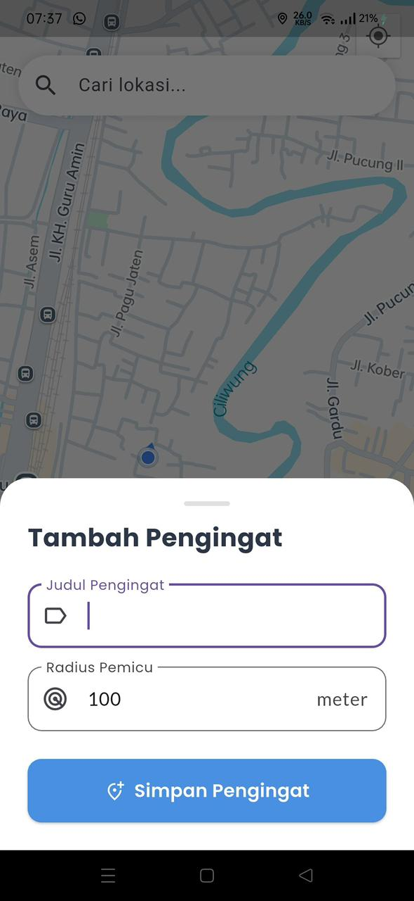

# 📍 TagIt - Aplikasi Pengingat Lokasi (Vibrasi & Alarm)

## Description

Aplikasi ini merupakan aplikasi Flutter berbasis lokasi (GPS) yang berfungsi untuk **mengingatkan pengguna saat mendekati lokasi tujuan tertentu**. Aplikasi ini mengirimkan **notifikasi berupa getaran dan alarm suara** saat pengguna berada dalam radius tertentu dari lokasi tujuan.

Aplikasi ini cocok untuk pengguna yang ingin mendapatkan pengingat lokasi saat bepergian, misalnya agar tidak terlewat turun dari kendaraan umum.

## Screenshots

## Features

- ✅ Pelacakan lokasi pengguna secara real-time
- ✅ Penetapan lokasi tujuan menggunakan peta interaktif (Google Maps)
- ✅ Penentuan radius pemicu alarm (misal: 500 meter)
- ✅ Notifikasi berupa **getaran (vibrasi)** dan **alarm suara**
- ✅ Pengaturan mode alarm, suara, dan durasi getaran _(opsional)_

## Tech Stack

- Flutter (SDK)
- Dart
- google_maps_flutter
- geolocator
- flutter_local_notifications
- vibration
